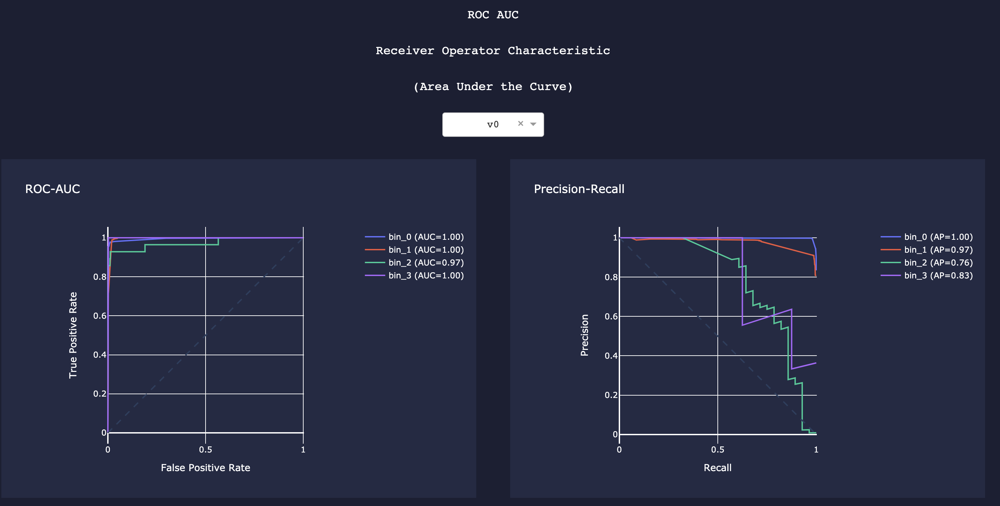
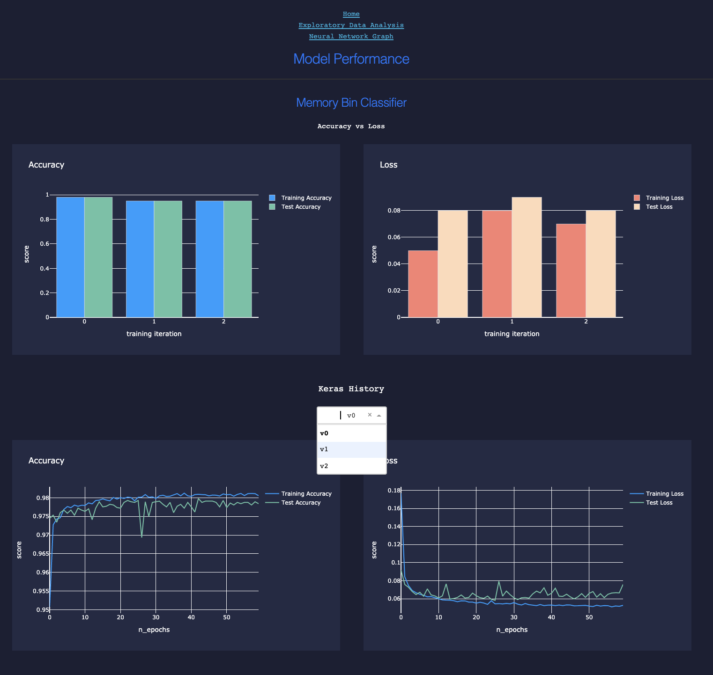

# spacekit

[](http://www.astropy.org)


[](https://www.codefactor.io/repository/github/alphasentaurii/spacekit)

Astronomical Data Science and Machine Learning Toolkit


## Setup

**Install with pip**

```bash
$ pip install spacekit
```

**Install from source**

```bash
$ git clone https://github.com/alphasentaurii/spacekit
$ cd spacekit
$ pip install -e .
```

*Testing*

See `tox.ini` for a list of test suite markers.

```bash
# run all tests
$ pytest

# some tests, like the `scan` module rely on the test `env` option 
$ pytest --env svm -m scan
$ pytest --env cal -m scan
```


### Pre-Trained Neural Nets

**Single Visit Mosaic Alignment (HST)**

[SVM Docs](https://spacekit.readthedocs.io/en/latest/skopes/hst/svm.html)

* Preprocessing: ``spacekit.skopes.hst.svm.prep``
* Predict Image Alignments: ``spacekit.skopes.hst.svm.predict``
* Train Ensemble Classifier: ``spacekit.skopes.hst.svm.train``
* Generate synthetic misalignments†: ``spacekit.skopes.hst.svm.corrupt``
        
*† requires Drizzlepac*
    
**Calibration Data Pipeline (HST)**

[CAL Docs](https://spacekit.readthedocs.io/en/latest/skopes/hst/cal.html)

* ``spacekit.skopes.hst.cal.train``


**Exoplanet Detection with time-series photometry (K2, TESS)**

[K2 Docs](https://spacekit.readthedocs.io/en/latest/skopes/kepler/light-curves.html)

* ``spacekit.skopes.kepler.light_curves``


### Customizable Model Building Classes

Build, train and experiment with multiple model iterations using the ``builder.architect.Builder`` classes

Example: Build and train an MLP and 3D CNN ensemble network

- continuous/encoded data for the multi-layer perceptron
- 3 RGB image "frames" per image input for the CNN
- Stack mixed inputs and use the outputs of MLP and CNN as inputs for the final ensemble model

```python
ens = BuilderEnsemble(XTR, YTR, XTS, YTS, name="svm_ensemble")
ens.build()
ens.batch_fit()

# Save Training Metrics
outputs = f"data/{date_timestamp}"
com = ComputeBinary(builder=ens, res_path=f"{outputs}/results/test")
com.calculate_results()
```
# Load and plot metrics to evaluate and compare model performance

Analyze and compare results across iterations from metrics saved using ``analyze.compute.Computer`` class objects. Almost all plots are made using plotly and are dynamic/interactive.

```python
# Load data and metrics
from spacekit.analyzer.scan import MegaScanner
res = MegaScanner(perimeter="data/2022-*-*-*")
res._scan_results()
```






### Preprocessing and Analysis Tools for Space Telescope Instrument Data


```python
from spacekit.analyzer.explore import HstCalPlots
res.load_dataframe()
hst = HstCalPlots(res.df, group="instr")
hst.scatter
```


```python
spacekit
└── spacekit
    └── analyzer
        └── compute.py
        └── explore.py
        └── scan.py
        └── track.py
    └── builder
        └── architect.py
        └── blueprints.py
    └── dashboard
    └── datasets
    └── extractor
        └── load.py
        └── radio.py
        └── scrape.py
    └── generator
        └── augment.py
        └── draw.py
    └── preprocessor
        └── encode.py
        └── scrub.py
        └── transform.py
    └── skopes
        └── hst
            └── cal
            └── svm
                └── corrupt.py
                └── predict.py
                └── prep.py
                └── train.py
        └── kepler
        └── trained_networks
└── setup.py
└── tests
└── docker
└── LICENSE
└── README.md
```


```bash
                       
           /\    _       _                           _                      *  
/\_/\_____/  \__| |_____| |_________________________| |___________________*___
[===]    / /\ \ | |  _  |  _  | _  \/ __/ -__|  \| \_  _/ _  \ \_/ | * _/| | |
 \./    /_/  \_\|_|  ___|_| |_|__/\_\ \ \____|_|\__| \__/__/\_\___/|_|\_\|_|_|
                  | /             |___/        
                  |/   

```
