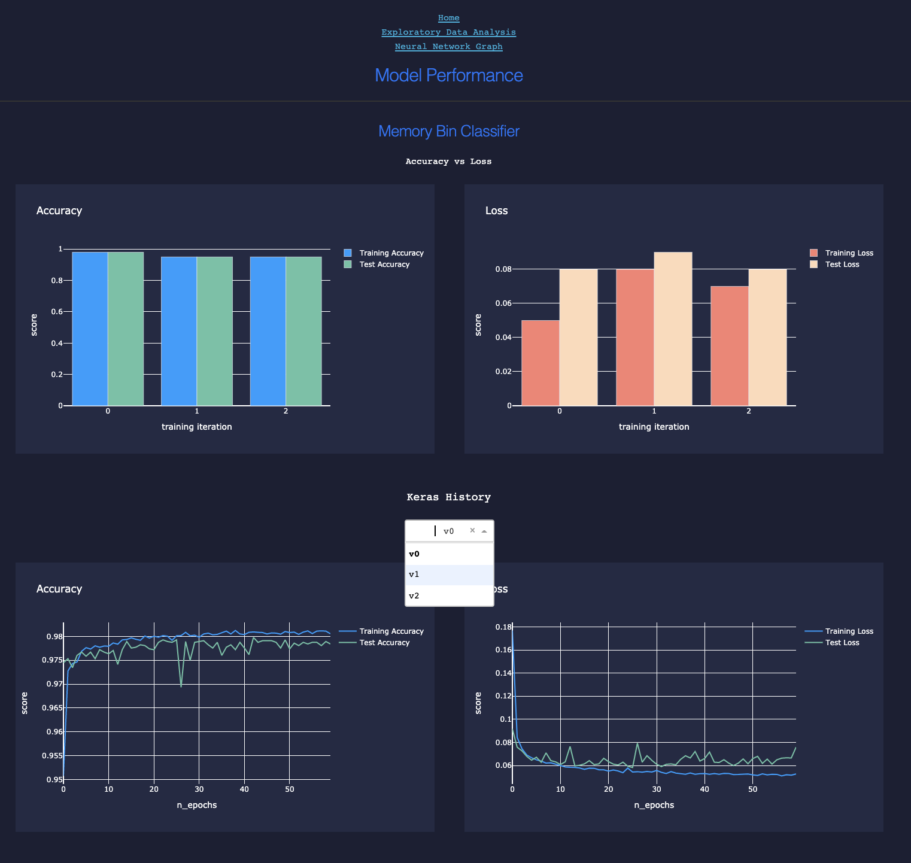
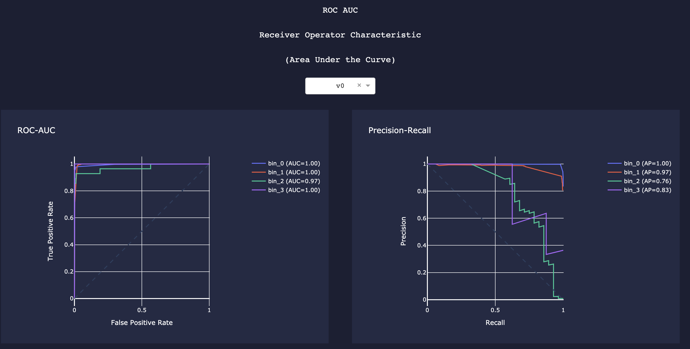
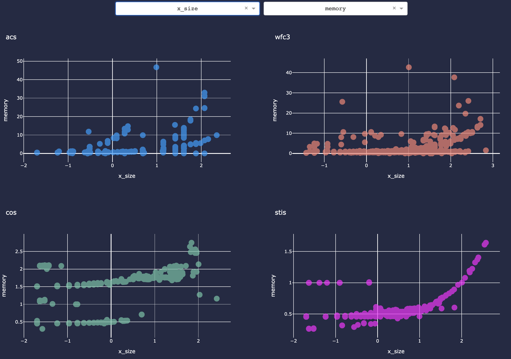

**********************
spacekit.dashboard.cal
**********************

*Model Performance + Statistical Analysis for the Hubble Space Telescope's data calibration pipeline.*

NOTE: Click the images on this page to zoom in.

.. currentmodule:: spacekit.dashboard.cal

This dashboard includes a simple home page linking to 3 individual pages: `model-evaluation`, `eda`, and `neural-network-graph`.

.. _model-evaluation:

Model Evaluation
----------------

When models are trained using spacekit, performance metrics can be recorded and saved to local disk, then loaded later elsewhere for analysis, including the generation of interactive plots. Under the hood, this is handled by the `:doc: Compute <../analyzer/compute>` module. The dashboard uses plotly and Flask to display these metrics in the browser:

*Compare accuracy vs. loss for 3 training iterations or versions of a model*

*ROC-AUC and Precision-Recall Plots*

.. _eda:

EDA
---

Generate interactive scatterplots for comparing linear relationships between two features (or feature vs. target) across groups of another feature.

*Scatterplots*

Inspect distribution of a single feature grouped by another feature (e.g. file size by instrument group)

*Box Plots*

.. image:: ../_static/images/eda-box-plots.png
  :width: 400
  :alt: hst cal dashboard box plots

.. _neural-network-graph:

Neural Network Graph
--------------------

Loads a single saved model and allows you to enter custom feature input values to see what the model would estimate or predict based on those inputs. The visualization displays the visible as well as hidden layers of the neural network and is fully interactive. This allows you to see in detail the exact weights and bias for every single node in the network. The inspiration for creating this type of visual was originally intended for an educational demonstration for my non-data scientist colleagues in order to remove some of the mystery behind how a neural network makes decisions in real-time to calculate an output's probability.

.. image:: ../_static/images/neural-network-graph.png
  :width: 400
  :alt: hst cal dashboard box plots
