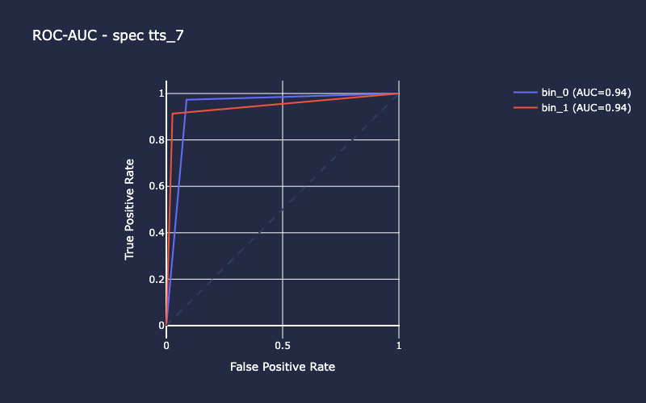

************************
spacekit.skopes.jwst.cal
************************

Resource Estimation Machine Learning Models for the JWST Calibration Pipeline
-----------------------------------------------------------------------------

Inference: Generate estimated memory footprints on unlabeled data.

Training: Build and train machine learning models for Image and Spec Level 3 pipelines

.. toctree::
   :maxdepth: 2

   predict <predict.rst>
   train <train.rst>

Setup
-----

**Install with pip**

.. code-block:: bash

    $ pip install spacekit

.. code-block:: bash

    $ git clone https://github.com/spacetelescope/spacekit
    $ cd spacekit
    $ pip install -e .

Run Inference
-------------

**from the command line**

.. code-block:: bash

    $ python -m spacekit.skopes.jwst.cal.predict /path/to/inputs

**from python**

.. code-block:: python

    from spacekit.skopes.jwst.cal.predict import JwstCalPredict
    input_path = "/path/to/level1/exposures"
    jcal = JwstCalPredict(input_path)
    jcal.run_inference()
    jcal.predictions
    {
        'jw01076-o101-t1_nircam_clear-f212n': {'gbSize': 10.02},
        'jw01076-o101-t1_nircam_clear-f210m': {'gbSize': 8.72},
        'jw01076-o101-t1_nircam_clear-f356w': {'gbSize': 7.38},
    }

Outputs: dictionary of level 3 products and estimated memory footprint (GB)

Run Training
------------

Examples below assume you are situated inside a directory where there is a subfolder named "train_2025-06-23" containing preprocessed datasets.
The script (or class) looks for the appropriate training dataset file inside this subfolder according to the `exp_mode` optional argument (by default this is `image`). So for level 3 image data, the file name would be train-image.csv; for the spec model, the filename would be train-spec.csv. These files are generated automatically by running :doc:`_ingest` on the raw JWST pipeline calibration metadata. Cross-validation can also be run on any desired number of splits (standard is 10 folds).

**from the command line**

.. code-block:: bash

    # Standard training on L3 image data stored in train_2025-06-23/train-image.csv (exp_mode=image by default, specifying here for clarity only)
    $ python -m spacekit.skopes.jwst.cal.train -d train_2025-06-23 --exp-mode image

    # Add early-stopping to cut training short as soon as performance is no longer improving (after 15 epochs)
    $ python -m spacekit.skopes.jwst.cal.train -d train_2025-06-23 --early-stopping val_rmse

.. admonition:: Cross-Validation
    :class: note

    Running cross-validation using 10 unique splits or "folds" of the entire dataset allows us to evaluate the model's generalization performance. If the model performs similarly across each of the 10 folds, this is a good indicator of the model's robustness - that is, it's more likely to perform just as well with new, unseen data.

.. code-block:: bash

    # Run 10-fold cross-validation on L3 spec data stored in train_2025-06-23/train-spec.csv
    $ python -m spacekit.skopes.jwst.cal.train -d train_2025-06-23 --exp-mode spec -k 10

**from python**

.. code-block:: python

    import os
    from spacekit.skopes.jwst.cal.train import JwstCalTrain
    training_data = os.path.join(os.getcwd(), "train_2025-06-23")
    jt = JwstCalTrain(
        training_data=training_data,
        out=None,
        exp_mode="image",
        norm=1,
        early_stopping='val_rmse',
    )
    jt.main()

.. admonition:: Note
    :class: note

    Additional hyperparameter tuning can be applied during model training from python by passing a dictionary into the `layer_kwargs` optional arg.
    For example, the code snippet below adds L2 kernel regularization on the first layer of the model.

.. code-block:: python

    js = JwstCalTrain(
        training_data=training_data,
        out="2025-06-24_1750795642", # save results in timestamped folder created previously when we trained the image model above
        exp_mode="spec",
        norm=1,
        cross_val=10,
        threshold=50,
        early_stopping='val_rmse',
        layer_kwargs={
            1:dict(kernel_regularizer='l2'),
        }
    )
    # stratify=True ensures test data target class includes at least one memory footprint >= `threshold` value (50 GB)
    js.main(stratify=True)
    

Example output stream (truncated) shows results of iteration number 7 of the 10 cross-validation folds for the L3 Spec model. Running cross-validation using 10 unique splits or "folds" of the entire dataset allows us to evaluate the model's generalization performance. If the model performs similarly across each of the 10 folds, this is a good indicator of the model's robustness - that is, it's more likely to perform just as well with new, unseen data.

.. code-block:: bash

    INFO:spacekit:Dropping 11136 duplicates
    INFO:spacekit:TX data saved as json file: /content/drive/MyDrive/Colab Notebooks/JWST/tx_data-spec.json
    INFO:spacekit:FITTING MODEL...
    06/24/2025 - 21:44:14 [i] STARTED [TRAINING ***SPEC3_REG***]
    06/24/2025 - 21:45:06 [i] COMPLETED [TRAINING ***SPEC3_REG***]
    Model: "spec3_reg"
    ┏━━━━━━━━━━━━━━━━━━━━━━━━━━━━━━━━━┳━━━━━━━━━━━━━━━━━━━━━━━━┳━━━━━━━━━━━━━━━┓
    ┃ Layer (type)                    ┃ Output Shape           ┃       Param # ┃
    ┡━━━━━━━━━━━━━━━━━━━━━━━━━━━━━━━━━╇━━━━━━━━━━━━━━━━━━━━━━━━╇━━━━━━━━━━━━━━━┩
    │ jwst_cal_spec3 (InputLayer)     │ (None, 18)             │             0 │
    ├─────────────────────────────────┼────────────────────────┼───────────────┤
    │ 1_dense18 (Dense)               │ (None, 18)             │           342 │
    ├─────────────────────────────────┼────────────────────────┼───────────────┤
    │ 2_dense36 (Dense)               │ (None, 36)             │           684 │
    ├─────────────────────────────────┼────────────────────────┼───────────────┤
    │ 3_dense72 (Dense)               │ (None, 72)             │         2,664 │
    ├─────────────────────────────────┼────────────────────────┼───────────────┤
    │ 4_dense144 (Dense)              │ (None, 144)            │        10,512 │
    ├─────────────────────────────────┼────────────────────────┼───────────────┤
    │ 5_dense288 (Dense)              │ (None, 288)            │        41,760 │
    ├─────────────────────────────────┼────────────────────────┼───────────────┤
    │ 6_dense144 (Dense)              │ (None, 144)            │        41,616 │
    ├─────────────────────────────────┼────────────────────────┼───────────────┤
    │ 7_dense72 (Dense)               │ (None, 72)             │        10,440 │
    ├─────────────────────────────────┼────────────────────────┼───────────────┤
    │ 8_dense36 (Dense)               │ (None, 36)             │         2,628 │
    ├─────────────────────────────────┼────────────────────────┼───────────────┤
    │ 9_dense18 (Dense)               │ (None, 18)             │           666 │
    ├─────────────────────────────────┼────────────────────────┼───────────────┤
    │ spec3_regressor (Dense)         │ (None, 1)              │            19 │
    └─────────────────────────────────┴────────────────────────┴───────────────┘
    Total params: 333,994 (1.27 MB)
    Trainable params: 111,331 (434.89 KB)
    Non-trainable params: 0 (0.00 B)
    Optimizer params: 222,663 (869.78 KB)
    INFO:spacekit:fit took 52.20901530s to execute
    15/15 ━━━━━━━━━━━━━━━━━━━━ 0s 9ms/step
    135/135 - 0s - 2ms/step - loss: 6.3838 - rmse: 2.5266
    15/15 - 0s - 5ms/step - loss: 7.1995 - rmse: 2.6832
    INFO:spacekit:Results saved to: 2025-06-24_1750795642/spec/results/7

Training Outputs
----------------

Assuming you've used the default `out=None` kwarg, the training outputs will be saved in a timestamped folder in your current working directory. In the examples above, this was a folder named "2025-06-24_1750795642". The exp_mode or JWST model type will be used to create a subdirectory inside that, and any autogenerated files will be stored beneath that as appropriate. The files inside each "results" folder can be auto-loaded using the :doc:`spacekit.analyzer.compute` classes for model evaluation and comparison. If running cross-validation, each iteration's files will be stored in its own subfolder named using the iteration index (0-9 for 10 folds). Additional metrics will be saved in the `summary` folder - mean scores for all 10 folds (image-cv-scores.json) as well as individual metrics for each fold iteration (image-cv-metrics.csv). The actual saved models (which can be loaded and used for inference elsewhere) are saved inside `models` using the model name attribute (e.g. `img3_reg.keras` and `spec3_reg.kers`).

.. code:: bash

    2025-06-24_1750795642/
    -| image/
        -| data/
            - image-tts_0.csv
            ...
            - image-tts_9.csv
        -| models/
            - img3_reg.png
            -| 0/
                - img3_reg_checkpoint.keras
                - img3_reg.keras
            ...
            -| 9/

        -| results/
            -| 0/
            ...
            -| 9/
                - history.npz
                - loss.npz
                - predictions.npy
                - residuals.npy
                - test_idx.npy
        -| summary
            - image-cv-metrics.csv
            - image-cv-scores.json

